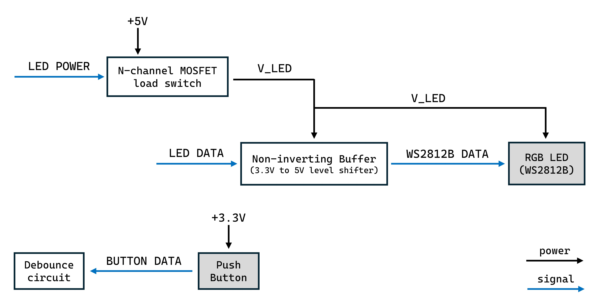

# Table Zamboni

## Hardware Block Diagram
The image below shows a high-level block diagram of the hardware architecture. 

### Main PCB
The main PCB uses an ESP32-S3-WROOM-1-N8 module and includes power management circuitry, a USB to UART converter, motor driver, and an inertial measurement unit.

### Time-of-Flight Breakout Board

### Peripherals Breakout Board
The peripherals breakout board includes a push button and a WS2812B LED. The LED will be used at specific points to communicate things to the user. Because it will only be used for short periods of time, to save power, a load switch is used. The block diagram below illustrates the hardware architecture of the peripherals breakout board. 
